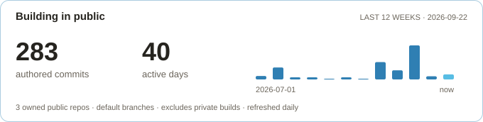

 

**I build AI workflows, connect GTM tools, and turn customer feedback into working systems.**

<table width="100%">
<tr>
<td width="25%" align="center"></td>
<td width="25%" align="center"></td>
<td width="25%" align="center"></td>
<td width="25%" align="center"></td>
</tr>
</table>

### 3 builds that show how I work

| I built it | What it lets me do |
| :--- | :--- |
|  **Professional Brain** Private, retrieval-ready GitHub knowledge system indexing my GTM experience, skills, metrics, interviews, and evidence, so AI pulls the precise context needed, not generic summaries. | **Build AI-ready knowledge systems.** Turn scattered work into structured, sourced, reusable intelligence. |
| **Personal Website** [aatifmulla.me ↗](https://aatifmulla.me/) A living portfolio built from my professional record: case studies, proof, and point of view, designed and shipped end to end. | **Turn experience into a digital product.** Connect strategy, storytelling, AI-assisted building, testing, and deployment. |
| **GTM Systems** [Explore live GTM systems ↗](https://aatifmulla.me/gtm-systems.html) Working examples of lead follow-up, lifecycle orchestration, and measurement systems built to make growth execution repeatable. | **Design connected GTM operations.** Route signals, automate handoffs, and expose conversion bottlenecks. |

### 🧠 
AI & automation

### 📊 GTM & analytics

### 🛠️ Build & ship

