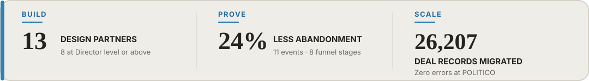

# Aatif Junaid Mulla

**GTM and Product Growth in San Francisco. I build GTM. Prove it. Scale it.**

- **13 design partners**, including 8 at Director level or above, recruited for Aisepedia; helped move one design-partner relationship into the first signed enterprise deal, Splunk (a Cisco company).
- **24% less early-stage abandonment** after connecting n8n, HubSpot, and Calendly, tracking 11 events across 8 funnel stages, and setting 22 lifecycle KPIs.
- **21 account executives and 26,207 deal records** migrated to a new system with zero errors at POLITICO; related reporting was read by the CEO, COO, and VP Finance.

[Portfolio](https://aatifmulla.me/) · [Case studies](https://aatifmulla.me/case-studies.html) · [Resume](https://aatifmulla.me/resume.pdf) · [LinkedIn](https://www.linkedin.com/in/aatif-junaid)
