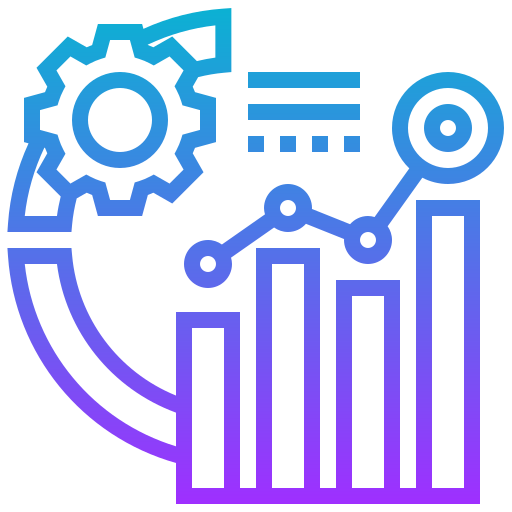
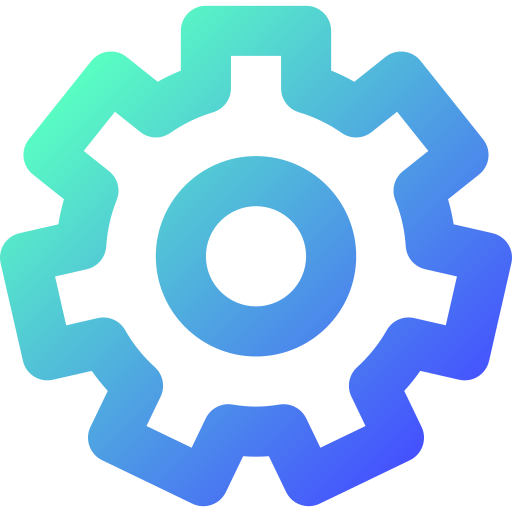
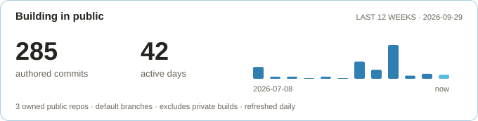

 

<h3 align="center">I build AI workflows, connect GTM tools, and turn customer feedback into working systems.</h3>

<table width="100%">
<tr>
<td width="25%" align="center"></td>
<td width="25%" align="center"></td>
<td width="25%" align="center"></td>
<td width="25%" align="center"></td>
</tr>
</table>

### 3 builds that show how I work

<table width="100%">
<thead><tr><th width="55%" align="center">What I built?</th><th width="45%" align="center">What it lets me do!</th></tr></thead>
<tbody>
<tr>
<td align="left" valign="top"><small> &nbsp; <strong>Professional Brain</strong> Private, retrieval-ready GitHub knowledge system indexing my GTM experience, skills, metrics, interviews, and evidence, so AI pulls the precise context needed, not generic summaries.</small></td>
<td align="left" valign="top"><small><strong>Build AI-ready knowledge systems.</strong> Turn scattered work into structured, sourced, reusable intelligence.</small></td>
</tr>
<tr>
<td align="left" valign="top"><small> &nbsp; <strong>Personal Website</strong> &nbsp; <a href="https://aatifmulla.me/">aatifmulla.me ↗</a> A living portfolio built from my professional record: case studies, proof, and point of view, designed and shipped end to end.</small></td>
<td align="left" valign="top"><small><strong>Turn experience into a digital product.</strong> Connect strategy, storytelling, AI-assisted building, testing, and deployment.</small></td>
</tr>
<tr>
<td align="left" valign="top"><small> &nbsp; <strong>GTM Operating System</strong> &nbsp; <a href="https://aatifmulla.me/gtm-systems.html">Explore my GTM operating system ↗</a> Working examples of lead follow-up, lifecycle orchestration, and measurement systems built to make growth execution repeatable.</small></td>
<td align="left" valign="top"><small><strong>Design connected GTM operations.</strong> Route signals, automate handoffs, and expose conversion bottlenecks.</small></td>
</tr>
</tbody>
</table>

###  AI & automation

     

###  GTM & analytics

                 

###  Build & ship

   

